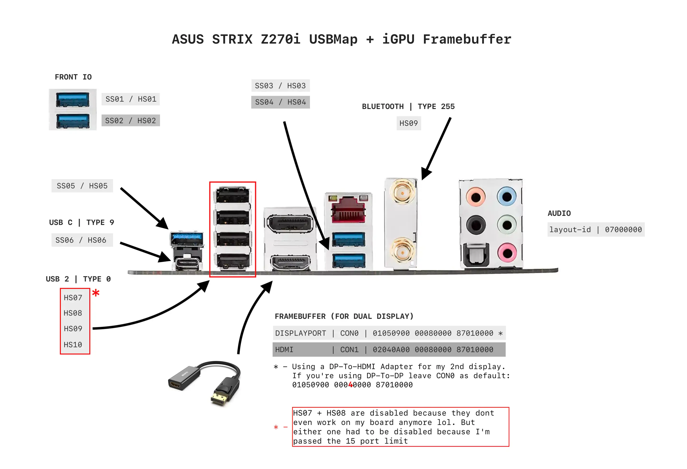
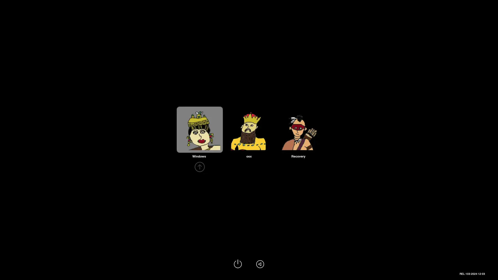

 
 </a>
 <h1>arifin[xyz]</h1>

<h3>WELCOME BLUD</h3>

# macOS 14.7.2 Sonoma on Z270 using OpenCore 1.0.3

## HARDWARE

* Asus Strix Z270i
* Intel i7-7700K
* Intel HD 630
* \~~AMD Radeon RX 580~~
* Asus GTX 750Ti (Disabled with SSDT)
* Audio Realtek ALC1220
* Ethernet Intel I219V7
* Wi-Fi + BT Wireless 8265 ( Taken from a broken laptop. This board comes with Atheros in most markets I believe.)
* Android Tethering using HoRNDIS
* 2 x Samsung 970 EVO (Dont recommend Samsung drives anymore. Lots of reliability issues and scares. BUYER BEWARE!!!)

## BIOS

* CSM: Disabled (mandatory)
* VT-d: Enabled (Needed post-Big Sur + WSL2 in Windows)
* Platform Power Management: Disabled ( stabilise your machine before enabling ASPM )
* XHCI Hand-Off: Enabled
* Network Stack: Disabled
* Wake on LAN: Disabled
* Initial Display Output: CPU Graphics
* Integrated Graphics: Enabled
* DVMT Pre-allocated: 1024MB
* Above 4G Decoding: Enabled
* CFG Lock: Disabled (mandatory)
* Fast Boot: Disabled
* OS Type: Windows 11
* Secure Boot: Disabled. Not worth enabling AT ALL if you're dual-booting Win 11. Microsoft always wants to take over the whole PC.

## WHAT WORKS?

* RX580 worked well for years and died. Currently have my old 750Ti for Windows. Disabled in
  macOS with an SSDT and working framebuffer settings for iGPU with 2 displays@144hz
* Shutdown and restart
* Ethernet
* Sound ( Realtek and HDMI )
* USB ports (USB port map for this board)
* Wifi + Bluetooth

## WHAT DOESNT?

* Sleep: iGPU hacks are fundamentally broken. It will just shut down and be greeted by an annoying system report upon reboot.
  Functional sleep **requires** an AMD GPU. If you're ok with "Fake Ass Sleep" just extend your screensaver to "never".

## ACPI

### DMAR/HPET/PLUG/XOSI/SBUS-MCHC/USB-Reset

Patched using SSDTTime from Windows

### SSDT-ECX.aml

USB Power settings and Fake EC (Laptop) because z270i has multiple EC's

### SSDT-NOVIDIA.aml

Disable GTX 750Ti for macOS

## Kexts

### Source the Kexts yourselves. Refer to config. Only USBModern and HoRNDIS provided in Kext folder

* Lilu 1.7.0
* NVMEFix 1.1.2
* Airportitlwm 2.3.0
* HibernationFixup 1.5.2
* BluetoolFixup 2.6.9
* IntelBluetoothFirmware 2.4.0
* IntelBTPatcher 2.4.0
* IntelMausi 1.0.8
* AppleALC 1.9.3
* AirportItlwm 2.3.0 - Sonoma14.4 Version!!
* WhateverGreen 1.3.7
* VirtualSMC 1.3.4 inc SMCProcessor + SMCSuperIO
* HoRNDIS 9.2 - Kext extracted from Official [HoRNDIS](https://github.com/jwise/HoRNDIS) Pkg

## USBModern.Kext

While you can map from macOS, its annoying as hell. If you're needing to map from scratch best to do it in windows with
[USBToolBox](https://github.com/USBToolBox/tool).

It must be noted I was unable to use the kext produced by USBToolbox but the mapping was indeed correct. So I copied over the mapping on to a previous kext made with the OG [USBMap](https://github.com/corpnewt/USBMap) which you can refer to in the provided EFI

## AUTHOR NOTES

* Funky Icons
* Been using SMBIOS iMac19,1 for a long time now. Works well. When i had my RX580 I was using iMacPro1,1 just for hardware DRM (Netflix etc).
* EnableSafeModeSlide, ProvideCustomSlide, ProvideMaxSlide = FALSE (for this MB)
* Security -> SecureBootModel = j185 or Default
* 7700K is hot-ass chip. Delidding and Liquid Metal helped tremendously in lowering temps esp where its hot n humid (Kuala Lumpur). Managed a steady OC at 5.1Ghz when i used to run it as my main machine. Now actually undervolting as its mainly used for Plex

*All attempts at hacking is solely your responsibility. Don't get mad at me if shit breaks LOL!
I hope this can serve as one of the many references for folks out there.*

**HAPPY HACKING**
